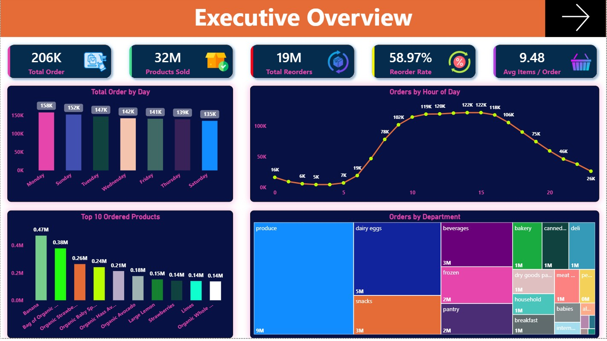
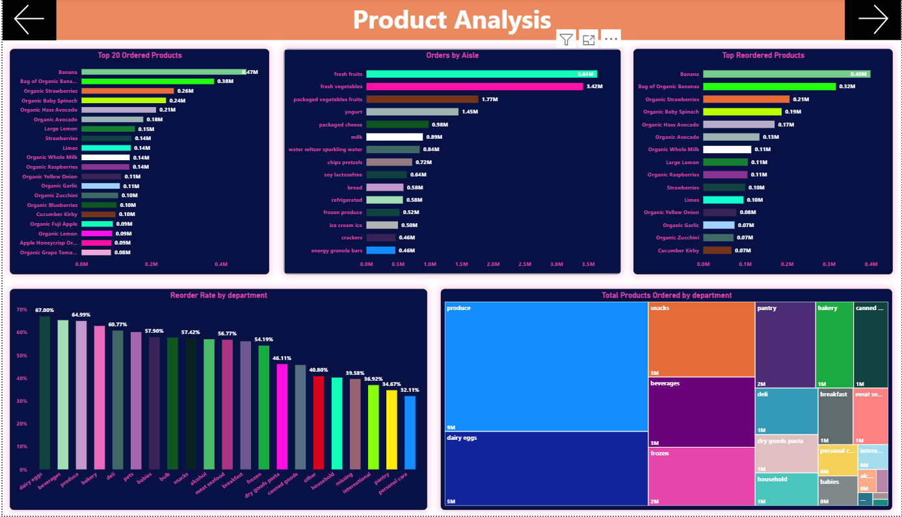
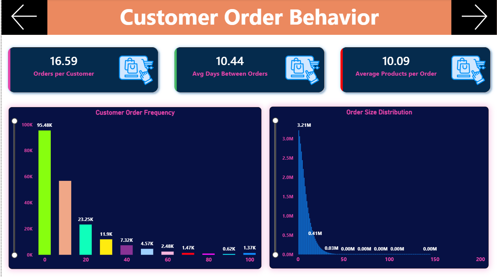
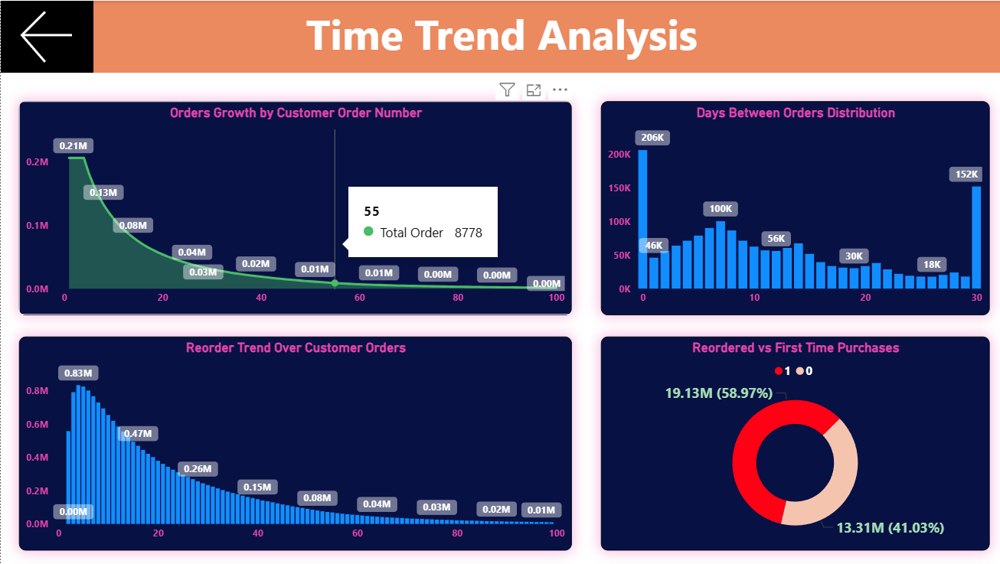

# 🛒 Instacart Market Basket Analysis | Power BI Dashboard

## 📌 Project Overview
This project analyzes the **Instacart Online Grocery Dataset** to understand customer purchasing behavior, product demand, and reorder patterns.  
The goal of this project is to transform raw transactional data into meaningful insights using **Power BI interactive dashboards**.

The dashboard provides insights into customer ordering trends, popular products, and reorder behavior to support better business decision-making.

---

# 🎯 Problem Statement
The online grocery platform Instacart generates a large amount of transactional data from customer orders. However, analyzing this raw data to understand customer purchasing behavior, product demand, and reorder patterns is challenging.

The objective of this project is to analyze historical order data to identify:
- Popular products
- Frequently reordered items
- Customer buying patterns

The insights are presented through an **interactive Power BI dashboard**.

---

# 🛠 Tools & Technologies Used
- Power BI  
- DAX (Data Analysis Expressions)  
- Data Modeling  
- Data Visualization  

---

# 📂 Dataset
The dataset used in this project is the **Instacart Online Grocery Dataset** which contains multiple tables:

- orders
- order_products_prior
- products
- aisles
- departments

These tables were connected using **data modeling relationships** in Power BI.

---

# 📊 Dashboard Pages

## 1️⃣ Executive Overview
Provides a high-level summary of key business metrics.

**Visuals Included**
- Total Orders
- Total Products Sold
- Total Reorders
- Reorder Rate
- Average Items per Order
- Orders by Day of Week
- Orders by Hour of Day
- Top Ordered Products
- Orders by Department

📷 Screenshot

---

## 2️⃣ Product Analysis
This page focuses on product demand and category analysis.

**Visuals Included**
- Top Ordered Products
- Orders by Aisle
- Orders by Department
- Reorder Rate by Department
- Top Reordered Products

📷 Screenshot

---

## 3️⃣ Customer Order Behavior
Analyzes customer purchasing habits and order frequency.

**Visuals Included**
- Average Days Between Orders
- Average Orders per Customer
- Average Products per Order
- Customer Order Frequency
- Order Size Distribution

📷 Screenshot

---

## 4️⃣ Time Trend Analysis
This page analyzes order trends and reorder behavior over time.

**Visuals Included**
- Orders Growth by Customer Order Number
- Reorder Trend Over Customer Orders
- Days Between Orders Distribution
- Reordered vs First-Time Purchases

📷 Screenshot

---

# 📈 Key Business Insights

1. A small group of products contributes to a large percentage of total orders.
2. Customers frequently reorder the same products, indicating strong product loyalty.
3. Certain departments dominate overall product demand.
4. Customers tend to place orders after consistent time intervals.
5. Peak ordering activity occurs during specific hours of the day.

---

# 📌 Conclusion
This Power BI dashboard successfully transforms raw Instacart transaction data into meaningful business insights.  
The analysis helps identify customer buying patterns, product demand, and reorder behavior, which can help businesses improve inventory management and marketing strategies.

---

# 🚀 Future Improvements
- Add customer segmentation analysis
- Build predictive models for reorder prediction
- Integrate real-time data for live dashboards

---

# 👨‍💻 Author
**Amit Kumar**

Data Analyst  
Skills: Power BI | SQL | Python | Excel | Data Visualization

# Instacart-Market-Basket-Analysis
Power BI dashboard analyzing the Instacart grocery dataset to uncover customer purchasing behavior, product demand, and reorder trends through interactive visualizations.
